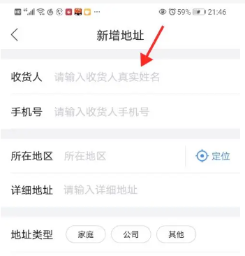
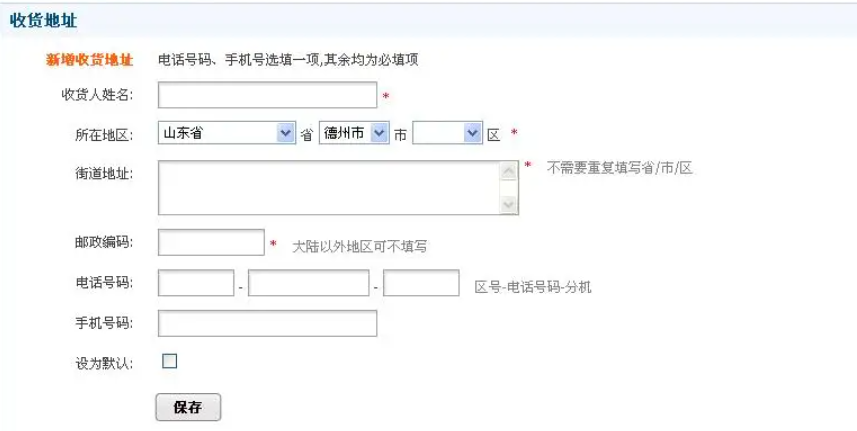

# 				前端

前端即[网站前台](https://baike.baidu.com/item/%E7%BD%91%E7%AB%99%E5%89%8D%E5%8F%B0/4849916)部分，运行在[PC](https://baike.baidu.com/item/PC/107)端，[移动](https://baike.baidu.com/item/%E7%A7%BB%E5%8A%A8/8464874)端等[浏览器](https://baike.baidu.com/item/%E6%B5%8F%E8%A7%88%E5%99%A8/213911)上展现给用户浏览的网页和界面。

前端开发中最基本也是最必须的三个技能。前端的开发中，在页面的布局时，

- HTML：页面结构：可以把他看成一个文档，定义展示页面的内容结构。
- CSS：页面表现：元素大小、颜色、位置、隐藏或显示、部分动画效果。
- JavaScript：页面行为：部分动画效果、页面与用户的交互、页面功能

 

# 一、HTML

HTML: 超文本标记语言，是 网页制作必备的编程语言**“**[超文本](https://baike.baidu.com/item/%E8%B6%85%E6%96%87%E6%9C%AC/2832422)**”**就是指页面内可以包含图片、[链接](https://baike.baidu.com/item/%E9%93%BE%E6%8E%A5/2665501)，甚至音乐、[程序](https://baike.baidu.com/item/%E7%A8%8B%E5%BA%8F/71525)等非文字元素。

### 1、HTML页面结构

超文本标记语言的结构包括“头"部分**（Head）**、和“主体”部分**（Body）**，其中“头”部提供关于网页的信息，“主体”部分提供网页的[具体](https://baike.baidu.com/item/%E5%85%B7%E4%BD%93/4577821)内容

```html
<!DOCTYPE html>
<html lang="zh-CN">
<head>
	<!-- 头部信息  不会再页面显示-->
	<meta charset="utf-8">
	<title></title>
</head>
<body>
	<!-- 主体部分 页面中显示内容-->
	<h1>第一个网页页面</h1>
</body>
</html>
```

#### 1、文档声明

DOCTYPE声明该html文件使用的HTML版本

**HTML 5**

```
<!DOCTYPE html>
```

**HTML 4.01 Strict**

```
<!DOCTYPE HTML PUBLIC "-//W3C//DTD HTML 4.01//EN" "http://www.w3.org/TR/html4/strict.dtd">
```

#### 2、页面头部 

第二行“<html>”标签和最后一行“</html>”定义html文档的整体，“<html>”标签中的‘lang=“en”’定义网页的语言为英文，定义成中文是'lang="zh-CN“。 “<head>”标签和“<body>”标签是它的第一层子元素，

<**head**>:标签里面负责对网页进行一些设置以及定义标题，设置包括定义网页的编码格式，外链css样式文件和javascript文件等，设置的内容不会显示在网页上，标题的内容会显示在标题栏。

#### 3、页面内容

<**body**>:元素定义文档的主体，也就是页面显示的内容。

body 元素包含文档的所有内容（比如文本、超链接、图像、表格和列表等等)，。

### 2、常见的HTML标签

#### 1、注释:<!-- -->

**定义和用法**

注释标签用于在源代码中插入注释。注释不会显示在浏览器中。

您可使用注释对您的代码进行解释，这样做有助于您在以后的时间对代码的编辑。当您编写了大量代码时尤其有用。

例：

```
<!--这是一段注释。注释不会在浏览器中显示。-->

<p>这是一段普通的段落。</p>
```

#### 2、标题标签：

**定义和用法**

*<h1> - <h6> 标签可定义标*。<h1> 定义最大的标题。<h6> 定义最小的标题。

由于 h 元素拥有确切的语义，因此请您慎重地选择恰当的标签层级来构建文档的结构。因此，请不要利用标题标签来改变同一行中的字体大小

```
<h1>这是标题 H1</h1>
<h2>这是标题 H2</h2>
<h3>这是标题 H3</h3>
<h4>这是标题 H4</h4>
<h5>这是标题 H5</h5>
<h6>这是标题 H6</h6>
```

#### 3、段落和换行标签

**定义和用法**

- **p :** 标签定义段落。元素会自动在其前后创建一些空白。浏览器会自动添加这些空间，您也可以在样式表中规定.

- **br:** 插入一个简单的换行符。标签是空标签，意味着它没有结束标签，

- **hr：**标签在 HTML 页面中创建一条水平线。水平分隔线（horizontal rule）可以在*视觉上*将文档分隔成各个部分，在 HTML 中，<hr> 标签没有结束标签。

#### 4、块标签

- **div标签**:标签块元素，表示一块内容，没有具体的语义。

  div标签可以把文档分割为独立的、不同的部分。它可以用作严格的组织工具，并且不使用任何格式与其关联。

  div中的部分会显示为红色

  ```html
  <div style="color:red">
      <h5>这是标题 H5</h5>
      <h6>这是标题 H6</h6>
  </div>
  ```

- **span标签** 行内元素，表示一行中的一小段内容，没有具体的语义。

  pan 没有固定的格式表现。当对它应用样式时，它才会产生视觉上的变化,

  ```html
  	<p>
          元素会自动在其前后创建一些空白。浏览器会自动添加这些空间
          <span style="color: cyan">span中的内容</span>
          您也可以在样式表中规定。
  	</p>
  ```

#### 5、含样式的行内标签

- ###### i 标签 :行内元素，字体斜体

- ###### b标签：行内元素，字体加粗


#### 6、图像标签和链接标签

- **img标签**

  img 元素向网页中嵌入一幅图像。

  请注意，从技术上讲， 标签并不会在网页中插入图像，而是从网页上链接图像。 标签创建的是被引用图像的占位空间。

   标签有两个必需的属性：src 属性 和 alt 属性。

  ```python
  
  ```

  | 属性                                                   | 描述                 |
  | ------------------------------------------------------ | -------------------- |
  | [alt](http://www.w3school.com.cn/tags/att_img_alt.asp) | 规定图像的替代文本。 |
  | [src](http://www.w3school.com.cn/tags/att_img_src.asp) | 规定显示图像的 URL。 |
  | height                                                 | 定义图像的高度。     |
  | width                                                  | 设置图像的宽度       |

- **a标签**：标签定义超链接，用于从一个页面链接到另一个页面

  ```html
<a href="http://www.baidu.com">点击链接跳转到百度</a>
  ```
  
- **link标签**(放在头部中)

  链接到一个外部样式，即链接外部的css文件


#### 8、列表

- **有序列表**

在网页上定义一个有编号的内容列表可以用<ol>、<li>配合使用来实现，代码如下：

```html
<ol>
    <li>列表文字一</li>
    <li>列表文字二</li>
    <li>列表文字三</li>
</ol>
```

在网页上生成的列表，每条项目上会按1、2、3编号，有序列表在实际开发中较少使用。

- **无序列表**

在网页上定义一个无编号的内容列表可以用<ul>、<li>配合使用来实现，代码如下：

```html
<ul>
    <li><a href="#">标题一</a></li>
    <li><a href="#">标题二</a></li>
    <li><a href="#">标题三</a></li>
</ul>
```

在网页上生成的列表，每条项目上会有一个小图标.

#### 9、表格

- **table** ：tabel标签定义 HTML 表格。


  简单的 HTML 表格由 table 元素以及一个或多个 tr、th 或 td 元素组成。

  tr 元素定义表格行，th 元素定义表头，td 元素定义表格单元。

```python
<table border="1" >
  <tr>
  	<th>name</th>
    <th>java</th>
    <th>python</th>
  </tr>
  <tr>
  	<td>小明</td>
    <td>精通</td>
    <td>熟悉</td>
  </tr>
  <tr>
  	<td>小张</td>
    <td>不会</td>
    <td>不会</td>
  </tr>
</table>
```

### 3、HTML表单

#### 1、form标签

- **form**: 标签用于为用户输入创建 HTML 表单，表单能够包含 [input 元素](http://www.w3school.com.cn/tags/tag_input.asp)，比如文本字段、复选框、单选框、提交按钮等等。

  **form标签的属性：**

  | 属性   | 描述                                    |
  | ------ | --------------------------------------- |
  | action | 定义表单数据提交地址                    |
  | method | 定义表单提交的方式（常见的有get和post） |

- **form表单中包含的元素**

  | 元素标签     | 作用                                       |
  | ------------ | ------------------------------------------ |
  | label标签    | 为表单元素定义文字标注                     |
  | input标签    | 定义通用的表单元素                         |
  | textarea标签 | 定义多行文本输入框                         |
  | select标签   | 定义下拉表单元素                           |
  | option标签   | 与select标签配合，定义下拉表单元素中的选项 |

#### 2、input标签

- **value属性**： 定义表单元素的值
- **name属性** ：定义表单元素的名称，此名称是提交数据时的键名

```html
	<form>
	  账号：<input type="text" name="username" id="user" />
	  <br />
	  密码：<input type="password" name="password" id="pw" />
	</form>
```

- **type属性**

  | 值       | 作用                                        |
  | -------- | ------------------------------------------- |
  | text     | 定义单行文本输入框                          |
  | password | 定义密码输入框                              |
  | radio    | 定义单选框                                  |
  | checkbox | 定义复选框                                  |
  | file     | 定义上传文件                                |
  | date     | 日期选择器                                  |
  | submit   | 定义提交按钮                                |
  | button   | 定义一个普通按钮                            |
  | reset    | 定义重置按钮                                |
  | image    | 定义图片作为提交按钮，用src属性定义图片地址 |
  | hidden   | 定义一个隐藏的表单域，用来存储值            |

#### 3、label标签

label 标签为 input 元素定义标注（标记）。

label 元素不会向用户呈现任何特殊效果。不过，它为鼠标用户改进了可用性。如果您在 label 元素内点击文本，就会触发此控件。就是说，当用户选择该标签时，浏览器就会自动将焦点转到和标签相关的表单控件上。

label 标签的 for 属性应当与相关元素的 id 属性相同

| 属性 | 对应值的描述                         |
| ---- | ------------------------------------ |
| for  | for 属性应当与相关元素的 id 属性相同 |

**案例：**

```html
	<form>
	  <label for="user">账号:</label>
	  <input type="text" name="username" id="user" />
	  <br />
	  <label for="pw">密码:</label>
	  <input type="password" name="password" id="pw" />
	</form>
```

#### 4、textarea标签

textarea标签定义多行的文本输入控件。

文本区中可容纳无限数量的文本，其中的文本的默认字体是等宽字体（通常是 Courier）。

可以通过 cols 和 rows 属性来规定 textarea 的尺寸，更好的办法是使用 CSS 的 height 和 width 属性。

```html
	<form action="11111" method="get" id='fo'>
		<textarea  name="text"></textarea>
		<input type="submit" name="" value="提交" >
	</form>
```

textarea的属性

| 属性                                                         | 值                 | 描述                                   |
| ------------------------------------------------------------ | ------------------ | -------------------------------------- |
| [autofocus](http://www.w3school.com.cn/tags/att_textarea_autofocus.asp) | autofocus          | 规定在页面加载后文本区域自动获得焦点。 |
| [cols](http://www.w3school.com.cn/tags/att_textarea_cols.asp) | *number*           | 规定文本区内的可见宽度。               |
| [disabled](http://www.w3school.com.cn/tags/att_textarea_disabled.asp) | disabled           | 规定禁用该文本区。                     |
| [form](http://www.w3school.com.cn/tags/att_textarea_form.asp) | *form_id*          | 规定文本区域所属的一个或多个表单。     |
| [maxlength](http://www.w3school.com.cn/tags/att_textarea_maxlength.asp) | *number*           | 规定文本区域的最大字符数。             |
| [name](http://www.w3school.com.cn/tags/att_textarea_name.asp) | *name_of_textarea* | 规定文本区的名称。                     |
| [placeholder](http://www.w3school.com.cn/tags/att_textarea_placeholder.asp) | *text*             | 规定描述文本区域预期值的简短提示。     |
| [readonly](http://www.w3school.com.cn/tags/att_textarea_readonly.asp) | readonly           | 规定文本区为只读。                     |
| [required](http://www.w3school.com.cn/tags/att_textarea_required.asp) | required           | 规定文本区域是必填的。                 |
| [rows](http://www.w3school.com.cn/tags/att_textarea_rows.asp) | *number*           | 规定文本区内的可见行数。               |

#### 5、select标签

select 元素可创建单选或多选菜单,,也可以用于选择数据提交表单。

```html
	<form>
	<select name='skill'>
	  <option value ="py">python</option>
	  <option value ="ht">html</option>
	  <option value="css">css</option>
	  <option value="java">javascript</option>
	</select>
	<input type="submit" name="">
	</form>
```

#### 6、option标签

option 元素定义下拉列表中的一个选项。option 元素位于 select 元素内部。

### 4、iframe

iframe 元素会创建包含另外一个文档的内联框架（即行内框架）。

例子：将登录页面的内容链接到当前页面

```html
<iframe src="http://www.taobao.com" height="200" width="400" >
```


### 5、练习作业

 



# 二、css

### 1、css介绍和引用

#### 1.1、CSS 概述

​	CSS：层叠样式表(英文全称：Cascading Style Sheets)是一种用来表现[HTML](https://baike.baidu.com/item/HTML)或[XML](https://baike.baidu.com/item/XML)（标准通用标记语言的一个子集）等文件样式的计算机语言。CSS不仅可以静态地修饰网页，还可以配合各种脚本语言动态地对网页各元素进行格式化，CSS 能够对网页中元素位置的排版进行像素级精确控制，支持几乎所有的字体字号样式，拥有对网页对象和模型样式编辑的能力

#### 1.2、css的基本语法

CSS 规则由两个主要的部分构成：选择器，以及一条或多条声明

选择器通常是您需要改变样式的 HTML 元素。

每条声明由一个属性和一个值组成。

属性（property）是您希望设置的样式属性（style attribute）。每个属性有一个值。属性和值被冒号分开。


#### 1.3、css引入方法：

1、外联式：通过link标签，链接到外部样式表到页面中。

```
<link rel="stylesheet" type="text/css" href="css/main.css">
```

2、嵌入式：通过style标签，在网页上创建嵌入的样式表。

```python
<style type="text/css">
    div{ 
        width:100px; 
        height:100px; 
        color:red 
    }
    ......
</style>
```

3、内联式：通过标签的style属性，在标签上直接写样式。

```
<div style="width:100px; height:100px; color:red ">......</div>
```

### 2、css背景

#### 2.1、**设置背景色**

background-color 设置背景色。这个属性接受任何合法的颜色值。

这条规则把元素的背景设置为红色：

```
p {background-color: red;}
```

#### 2.2、**设置背景图像**

 background-image：要把图像放入背景， 属性的默认值是 none，表示背景上没有放置任何图像。如果需要设置一个背景图像，**必须为这个属性设置一个 URL 值：**

```
body {background-image: url(/i/eg_bg_04.gif);}
```

大多数背景都应用到 body 元素，不过并不仅限于此。

- **背景图平铺**

  如果需要在页面上对背景图像进行平铺，可以使用 [background-repeat 属性](http://www.w3school.com.cn/cssref/pr_background-repeat.asp)。

  **属性值 ：**

  - repeat  导致图像在水平垂直方向上都平铺，就像以往背景图像的通常做法一样

  - repeat-x  ：图像只在水平上重复，

  - repeat-y ：图像在垂直方向上重复

  - no-repeat ：不允许图像在任何方向上平铺。

  默认地，背景图像将从一个元素的左上角开始。请看下面的例子：

  ```css
  body
    { 
    background-image: url(/i/eg_bg_03.gif);
    background-repeat: repeat-y;
    }
  ```

#### 2.3、背景大小

```python
# 通过像素指定
background-size: 100px  20px;
# 通过百分比指定
background-size: 10%  20%;
# 原始图片大小
background-size:auto;
# 背景填满容器
background-size:cover;
```

### 3、颜色表示法

**颜色三种表示方法：**

- 颜色名表示，比如：red ，cyan  gold

- rgb表示，比如：rgb(255,0,0)表示红色

- 16进制数值表示，比如：#FFFF00 表示黄色

**颜色对照表地址：<http://tool.oschina.net/commons?type=3>**

### 4、css文本样式

常用的应用文本的css样式：

- **color 设置文字的颜色，**
  -  color:red;
- **font-size 设置文字的大小**
  - font-size:12px;
- **font-family 设置文字的字体**
  - font-family:'微软雅黑';
- **font-style 设置字体是否倾斜：**
  -   不倾斜:  font-style:'normal';  
  -   倾斜:  font-style:'italic';        
- **font-weight 设置文字是否加粗，**
  - font-weight:bold     设置加粗
  -  font-weight:normal 设置不加粗
- **line-height 设置文字的行高 (行高相当于在每行文字的上下同时加间距)，**
  -  line-height:30px;

- **设置文字的几个属性，顺序如下：** **font：是否加粗   字号 /行高    字体；**
  -  font:normal 12px/36px '微软雅黑';
- **text-indent 设置文字首行缩进**
  - text-indent:24px; 设置文字首行缩进24px
- **text-align 设置文字水平对齐方式**
  - 如text-align:center 设置文字水平居中

### 5、css选择器

#### 5.1、标签选择器

最常见的 CSS 选择器是元素选择器。换句话说，文档的元素就是最基本的选择器。

如果设置 HTML 的样式，选择器通常将是某个 HTML 元素，比如 p、h1、em、a，甚至可以是 html 本身：

```css
<h1>h1标题</h1>
<h2>h2标题</h2>

h1 {color:blue;}
h2 {color:silver;}
```

#### 5.2、id选择器

首先，ID 选择器前面有一个 # 号 

通过id名来选择元素，元素的id名称不能重复，所以一个样式设置项只能对应于页面上一个元素，一个ID只能在文档中使用一次，id名一般给程序使用，所以不推荐在css设置样式时使用id作为选择器

```css
<input type="test" name="uname" id="user">
#user {
    font-weight:bold;
}
```

#### 5.3、类选择器

必须将 class 指定为一个适当的值，类名前有一个点号（.）,通过class类名来选择元素，一个类可应用于多个元素，一个元素上也可以使用多个类，应用灵活，可复用，是css中应用最多的一种选择器。

```css
<div class="menu"></div>

.menu {
    color:red;
}
```

#### 5.4、属性选择器

通过元素的属性进行选择，

选择带name属性的a标签

```css
<a href="" name="nb"></a>
<a href=""></a>
<a href=""></a>

a[name] {color:red;}
```

#### 5.5、包含选择器（层级选择器）

主要应用在选择父元素下的子元素，或者子元素下面的子元素，可与标签元素结合使用，减少命名，同时也可以通过层级，防止命名冲突。

```css
<div class="menu">
	<div>
		<p>p标签</p>
	</div>
</div>

.menu div p{
    color:cyan
}
```

#### 5.6、组选择器

多个选择器，，每个选择器之间用逗号隔开如果有同样的样式设置，可以使用组选择器。

```
h1, 
h2, 
h3 {
	color:blue;
}
```

#### 5.7、伪类及伪元素选择器

**伪类**

在支持 CSS 的浏览器中，链接的不同状态都可以不同的方式显示，这些状态包括：活动状态，已被访问状态，未被访问状态，和鼠标悬停状态。

| 属性                                                         | 描述                                     |
| ------------------------------------------------------------ | ---------------------------------------- |
| [:active](http://www.w3school.com.cn/cssref/pr_pseudo_active.asp) | 向被激活的元素添加样式。                 |
| [:focus](http://www.w3school.com.cn/cssref/pr_pseudo_focus.asp) | 向拥有键盘输入焦点的元素添加样式。       |
| [:hover](http://www.w3school.com.cn/cssref/pr_pseudo_hover.asp) | 当鼠标悬浮在元素上方时，向元素添加样式。 |
| [:link](http://www.w3school.com.cn/cssref/pr_pseudo_link.asp) | 向未被访问的链接添加样式。               |
| [:visited](http://www.w3school.com.cn/cssref/pr_pseudo_visited.asp) | 向已被访问的链接添加样式。               |


### 6、css模型框

**CSS 框模型 (Box Model) 规定了元素框处理元素内容、内边距、边框 和 外边距 的方式。**

   

元素框的最内部分是实际的内容，直接包围内容的是内边距。内边距呈现了元素的背景。内边距的边缘是边框。边框以外是外边距，外边距默认是透明的，因此不会遮挡其后的任何元素。

#### 1、边框

元素的边框 (border) 是围绕元素内容和内边距的一条或多条线。border 属性允许你规定元素边框的样式、宽度和颜色。

border-style 的默认值是 none，如果没有声明样式，就相当于 border-style: none。**因此，如果您希望边框出现，就必须声明一个边框样式**

**CSS 边框属性**

| 属性                                                         | 描述                                                         |
| ------------------------------------------------------------ | ------------------------------------------------------------ |
| [border](http://www.w3school.com.cn/cssref/pr_border.asp)    | 简写属性，用于把针对四个边的属性设置在一个声明。             |
| [border-style](http://www.w3school.com.cn/cssref/pr_border-style.asp) | 用于设置元素所有边框的样式，或者单独地为各边设置边框样式。   |
| [border-width](http://www.w3school.com.cn/cssref/pr_border-width.asp) | 简写属性，用于为元素的所有边框设置宽度，或者单独地为各边边框设置宽度。 |
| [border-color](http://www.w3school.com.cn/cssref/pr_border-color.asp) | 简写属性，设置元素的所有边框中可见部分的颜色，或为 4 个边分别设置颜色。 |

除了以上四种，还可以对四个方向单独设

**border的样式类型**

 

```
solid    # 实线
dotted   # 点线
double   # 双线
```

#### 2、内边距

padding 属性定义元素边框与元素内容之间的空白区域。

**CSS 内边距属性**

| 属性                                                         | 描述                                                 |
| ------------------------------------------------------------ | ---------------------------------------------------- |
| [padding](http://www.w3school.com.cn/cssref/pr_padding.asp)  | 简写属性。作用是在一个声明中设置元素的所内边距属性。 |
| [padding-bottom](http://www.w3school.com.cn/cssref/pr_padding-bottom.asp) | 设置元素的下内边距。                                 |
| [padding-left](http://www.w3school.com.cn/cssref/pr_padding-left.asp) | 设置元素的左内边距。                                 |
| [padding-right](http://www.w3school.com.cn/cssref/pr_padding-right.asp) | 设置元素的右内边距。                                 |
| [padding-top](http://www.w3school.com.cn/cssref/pr_padding-top.asp) | 设置元素的上内边距。                                 |

设置的时候可以通过像素，也可以按元素的百分比进行设置。

h1 元素的各边都有 10 像素的内边距，只需要这样：

```
h1 {padding: 10px;}
```

也可以给四个方向设置不同值，这些值的顺序是从上外边距 (top) 开始围着元素顺时针旋转的：

```
margin: top right bottom left
```

另外

把段落的内边距设置为父元素 width 的 10%：

```
p {padding: 10%;}
```

#### 3、外边距

设置外边距的最简单的方法就是使用 margin 属性，这个属性接受任何长度单位、百分数值甚至负值。

**外边距属性**

| 属性                                                         | 描述                                       |
| ------------------------------------------------------------ | ------------------------------------------ |
| [margin](http://www.w3school.com.cn/cssref/pr_margin.asp)    | 简写属性。在一个声明中设置所有外边距属性。 |
| [margin-bottom](http://www.w3school.com.cn/cssref/pr_margin-bottom.asp) | 设置元素的下外边距。                       |
| [margin-left](http://www.w3school.com.cn/cssref/pr_margin-left.asp) | 设置元素的左外边距。                       |
| [margin-right](http://www.w3school.com.cn/cssref/pr_margin-right.asp) | 设置元素的右外边距。                       |
| [margin-top](http://www.w3school.com.cn/cssref/pr_margin-top.asp) | 设置元素的上外边距                         |

- ##### 超出范围内容隐藏

    ```
    overflow: hidden;
    ```

    

### 7、浮动和定位

#### 1、CSS 定位机制

CSS 有三种基本的定位机制：普通流、浮动和绝对定位。

除非专门指定，否则所有框都在普通流中定位。也就是说，普通流中的元素的位置由元素在 (X)HTML 中的位置决定。

块级框从上到下一个接一个地排列，框之间的垂直距离是由框的垂直外边距计算出来。

通过使用 [position 属性](http://www.w3school.com.cn/cssref/pr_class_position.asp)，我们可以选择不同类型的定位。

#### 2、相对定位

注意，在使用相对定位时，无论是否进行移动，元素仍然占据原来的空间。因此，移动元素会导致它覆盖其它框。

如果将 top 设置为 20px，那么框将在原位置顶部下面 20 像素的地方。如果 left 设置为 30 像素，那么会在元素左边创建 30 像素的空间，也就是将元素向右移动。

```css
#box_relative {
  position: relative;
  left: 30px;
  top: 20px;
}
```

> ###### Demo
>
> ```python
> # css
> <style type="text/css">
>     div{
>         width: 100px;
>         height: 100px;
>     }
>     .box1{
>         background: #000000;
>     }
>     .box2{
>         background: #FF0000;
>     }
>     .box3{
>         background: #00FFFF;
> }
> </style>
> # html
> <body>
>     <div class="box1"></div>
>     <div class="box2"></div>
>     <div class="box3"></div>
> </body>
> ```
>
> 

#### 3、绝对定位

绝对定位使元素的位置与文档流无关，因此不占据空间。这一点与相对定位不同，相对定位实际上被看作普通流定位模型的一部分，因为元素的位置相对于它在普通流中的位置。

因为绝对定位的框与文档流无关，所以它们可以覆盖页面上的其它元素。可以通过设置 [z-index 属性](http://www.w3school.com.cn/cssref/pr_pos_z-index.asp)来控制这些框的堆放次序。

```css
#box {
  position: absolute;
  left: 30px;
  top: 20px;
}
```

> ###### Demo
>
> ```css
> # html
> <div class="musen">
>     <div class="box1"></div>
>     <div class="box2"></div>
>     <div class="box3"></div>
> </div>
> 
> # css
> .musen{
>     height: 600px;
>     width: 600px;
>     background: #55aa7f;
> }
> .musen div{
>     height: 100px;
>     width: 100px;
> }
> .box1{
> 	background: #000000;
> }
> .box2{
>     background: #FF0000;
> }
> .box3{
>     background: #00FFFF;
> }
> ```


 

#### 4、固定位置

- ###### 需要设置**position:fixed;**，直接以**浏览器窗口**作为参考进行定位，它是浮动在页面中，元素位置**不会随浏览器窗口的滚动条滚动而变化**

#### 5、浮动

浮动的框可以向左或向右移动，直到它的外边缘碰到包含框或另一个浮动框的边框为止。由于浮动框不在文档的普通流中，所以文档的普通流中的块框表现得就像浮动框不存在一样。

在 CSS 中，我们通过 float 属性实现元素的浮动。

```css
img{
  float:right;
  }
```

| 值      | 描述                                                 |
| ------- | ---------------------------------------------------- |
| left    | 元素向左浮动。                                       |
| right   | 元素向右浮动。                                       |
| none    | 默认值。元素不浮动，并会显示在其在文本中出现的位置。 |
| inherit | 规定应该从父元素继承 float 属性的值。                |

- ###### 浮动塌陷：

    由于父元素没有设置高度，子元素浮动之后，会影响后面元素的布局

    - 1、给父元素设置overflow属性：hidden
    - 2、在浮动元素之后，添加额外的块级子元素，并设置clear: both;

    ```
    .clear{	
    	clear: both;
    }
    ```


### 8、display属性

display属性是用来设置元素的类型及隐藏的，常用的属性有：

- none 元素隐藏
- block 元素以块元素显示

### 9、Flex 布局

Flex是Flexible Box的缩写，意为”弹性布局”，用来为盒状模型提供最大的灵活性。

任何一个容器都可以通过` display: flex;`指定为Flex布局。当容器被指定为Flex布局后，所有的子元素都可以看出容器中的一个**项目**，

- ###### 注意点： 设置为Flex布局之后，子元素的`float`、`clear`和`vertical-align`属性将失效。 

```
.box{
  display: flex;
}
```

- #### 容器的属性

    - ######  `flex-direction`: 设置项目排列的主轴方向

        

        > - `row`（默认值）：主轴为水平方向，起点在左端。
        > - `row-reverse`：主轴为水平方向，起点在右端。
        > - `column`：主轴为垂直方向，起点在上沿。
        > - `column-reverse`：主轴为垂直方向，起点在下沿。

    - ######  `justify-content` ： 定义了项目在主轴上的对齐方式 

        它可能取5个值，具体对齐方式与轴的方向有关。下面假设主轴为从左到右。

        > - `flex-start`（默认值）：左对齐
        > - `flex-end`：右对齐
        > - `center`： 居中
        > - `space-between`：两端对齐，项目之间的间隔都相等。
        > - `space-around`：每个项目两侧的间隔相等。所以，项目之间的间隔比项目与边框的间隔大一倍。

    - ######  `align-items`：属性定义项目在交叉轴上如何对齐。 

      具体的对齐方式与交叉轴的方向有关，下面假设交叉轴从上到下。

        > - `flex-start`：交叉轴的起点对齐。
        > - `flex-end`：交叉轴的终点对齐。
        > - `center`：交叉轴的中点对齐。
        > - `baseline`: 项目的第一行文字的基线对齐。
        > - `stretch`（默认值）：如果项目未设置高度或设为auto，将占满整个容器的高度。
      
    
- #### 子元素的属性

    - ######  order ：项目排列的顺序，值越小的排前面

    - ######  flex ：指定项目如何分配容器中的剩余空间


- ### 网易云顶部菜单案例

    - ##### html结构

        ```html
        <div class="top_menu">
        			<div class="main">
        				<div class="log"></div>
        				<div class="menus">
        					<ul>
        						<li>发现音乐</li>
        						<li>我的音乐</li>
        						<li>关注</li>
        						<li>商城</li>
        						<li>音乐人</li>
        						<li>下载客户端</li>
        					</ul>
        				</div>
        				<div class="login">登录</div>
        				<!-- 创作者中心 -->
        				<div class="user">创造者中心</div>
        				<!-- 搜索框 -->
        				<div class="search">
        					<div class="lable">
        						<div class="bj"></div>
        						<input type="text">				
        					</div>					
        				</div>
        			</div>
        		</div>
        ```

        - ### CSS样式

        ```css
        body,ul{
            margin: 0;
        }
        
        .top_menu{
            width: 100%;
            background: #323232;
            height: 70px;
            min-width: 1200px;
        }
        
        .main{
            width: 1100px;
            margin: 0 auto;
            color: #fff;
        
        }
        .log{
            float: left;
            width: 176px;
            height: 70px;
            background: url(image/topbar.png);
        }
        .menus{
            float: left;
            width: 600px;
        }
        .menus li{
            float: left;
            list-style: none;
            height: 70px;
            line-height: 70px;
            padding: 0 18px;
        }
        .menus li:hover{
            cursor: pointer;
            background: #000000;
        }
        .search{
            float: right;
            width: 158px;
            height: 70px;
            line-height: 70px;
        
        }
        
        .lable{
            background: #fff;
            border-radius: 20px;
            height: 30px;
            position: relative;
            top: 20px;
            /* 设置为flex布局：让图标和输入框显示在同一行 */
            display: flex;
        
        }
        .lable .bj{
            width: 35px;
            height: 100%;
            background: url(image/topbar.png);
            background-position: 0px 115px;
        }
        /* 去除input的边框 */
        .search input{
            width: 100px;
            border: none;
        
        }
        /* 去除input被激活时的边框 */
        .search input:focus{
            outline: none;
        }
        
        .user{
            float: right;
            width: 90px;
            height: 32px;
            margin: 19px 0 0 12px;
            color:#ccc;
            border: solid 1px #4f4f4f;
            border-radius: 16px;
            line-height: 32px;
            font-size: 10px;
            text-align: center;
        
        }
        .login{
            float: right;
            height: 70px;
            font: normal 10px/70px "microsoft yahei";
            margin: 0 0 0 20px;
            color: #9e9e9e;
        }
        ```

        


# 三、javascript

## 1、介绍和基本使用

#### 1.1、javascript概述

- ##### JavaScript历史

  要了解JavaScript，我们首先要回顾一下JavaScript的诞生。在上个世纪的1995年，当时的网景公司正凭借其Navigator浏览器成为Web时代开启时最著名的第一代互联网公司。由于网景公司希望能在静态HTML页面上添加一些动态效果，于是叫Brendan Eich这哥们在两周之内设计出了JavaScript语言。你没看错，这哥们只用了10天时间。为什么起名叫JavaScript？原因是当时Java语言非常红火，所以网景公司希望借Java的名气来推广，但事实上JavaScript除了语法上有点像Java，其他部分基本上没啥关系。


#### 1.2、嵌入页面的方式

HTML 中的脚本必须位于` <script> 与 </script>` 标签之间。脚本可被放置在 HTML 页面的 `<body> `和 `<head>` 部分中。

1、行间事件（主要用于事件）

```
<input type="button" name="" onclick="alert('ok！');">
```

2、页面script标签嵌入

```
<script type="text/javascript">        
    alert('ok！');
</script>
```

3、外部引入

```
<script type="text/javascript" src="js/index.js"></script>
```

## 2、基本语法

#### 1、注释

我们可以添加注释来对 JavaScript 进行解释，或者提高代码的可读性。

- 单行注释：以 // 开头。
- 多行注释：以 /* 开始，以 */ 结尾。

#### 2、变量

- ##### 变量命名：

  - 变量可以使用短名称（比如 x 和 y），也可以使用描述性更好的名称（比如 age, sum）。
  - 变量推荐使用字母开头，变量也能以 $ 和 _ 符号开头（不过我们不推荐这么做）
  - 变量名区分大小写（y 和 Y 是不同的变量）
  - 驼峰式命名（小驼峰）
  
- 变量声明

  javaScript中变量可以先声明后赋值，

```javascript
var x;
x = 20;
```

也可以在声明的时候赋值。

```javascript
var y=3;
```

同时给多个变量赋值

```javascript
var a = 100，b = 200,c = 300;
```

定义变量的三种方式：

- ###### var：定义的变量可以跨代码块访问。

- ###### let：定义块级作用局的变量

- ###### const: 定义常初始化必须赋值，值不可修改，只能在块级作用域访问


#### 3、数据类型：

**字符串、数字、布尔、Null、Undefined、数组**

- **number 数字类型(包含整数和小数)**

  ```
  var y=3;
  ```

- **string 字符串类型**

  ```
  var st='python'
  ```

- **boolean 布尔类型**

  - ###### 只有 true 或 false两个值

- ##### undefined 类型，

  - ###### 变量已声明 未赋值，它的值就是undefined

  ```javascript
  var unde
  ```

- **null类型**，

  - ###### 表示空对象，类似于python中的None

  ```javascript
  var tr = null
  ```

- **arry  数组**

  - ###### 数值类似于python中的列表，可以通过下标取值

    ```javascript
    //创建数组
    var skill= Array("html","css","js");
    alter(skill[0]);
    ```

  - ###### length属性：获取数组长度：

    ```javascript
    alter(skill.length)
    ```

  - ###### pop() 方法从数组中删除最后一个元素

    ```javascript
    skill.pop()
    ```

  - ###### push() 方法（在数组结尾处）向数组添加一个新的元素

    ```javascript
    skill.push('jquery')
    ```

    

#### 4、运算符

- ###### 算术运算符： +(加)、 -(减)、 *(乘)、 /(除)、 %(求余)

- ###### 赋值运算符：=、 +=、 -=、 *=、 /=、 %= 、++

- ###### 比较运算符：` ==`、`===`、>、>=、<、<=、`!=`、

- ###### 逻辑运算符：&&(与)、||(或 )、!(否 )

#### 5、条件语句

通过条件来控制程序的走向，就需要用到条件语句。

- ##### if 语句

  ```javascript
  var a = 199;
  if(a>200){
      alert('大于200');
  }
  ```

- ##### else 语句

  ```javascript
  var a = 199;
  if(a>200){
      alert('大于200');
  }
  else {
      alert(a);
  }
  ```

- ##### else if 语句

  - ###### 类似python中的 elif

  ```javascript
  var a = 199;
  if(a>200){
      alert('大于200');
  }
  else if(a>100){
      alert('大于100')
  }
  else {
      alert(a);
  }
  ```


#### 6、函数

- ##### 函数定义：

  - ###### 定义函数的关键词 function，函数内的代码块，包裹在花括号中：

    ```javascript
    // 函数的定义 使用function
    function func() {
        alter(999)
    }
    // 函数调用
    func()
    ```

  - ###### 提示：JavaScript 对大小写敏感。关键词 function 必须是小写的

- ##### 函数参数：

  ```javascript
  function addNumber(var1,var2) {
      alert(var1 + var2;);    
  }
  addNumber(11,22)
  ```

- ##### 函数返回值：

  - ###### 使用 return 来返回值。在使用 return 语句时，函数会停止执行，并返回指定的值。

    ```javascript
    function addNumber(var1, var2) {
        return var1 + var2;
    }
    var res = addNumber(11,222);
    alert(res)
    ```


#### 7、对象

- ##### 创建对象

  ###### 对象由花括号分隔。在括号内部，

  - ##### 方式一：

  ```
  objA = new Object();
  ```

  - ##### 方式二：类式于python中的字典，

  ```
  var objA={};
  ```

- ##### 对象属性

  - ###### 对象的属性以名称和值对的形式 (name : value) 来定义。属性由逗号分隔：

    ```python
    var objA={name : "python",age  : 18,id :123};
    ```

  - ###### 创建对象属性声明可横跨多行：

    ```javascript
    var objA={
    name : "python",
    age  : 18,
    id :123
    };
    ```

- ##### 对象方法

  - ###### 对象方法是作为属性来存储的函数。

  - ```javascript
    var objC = {                // 创建对象 ：方式3
        name: 'abc',
        age: 19,
        fun: function (var1,var2) {
            alert(var1);
            alert(var2);
            alert(this.age * 2);
        }
    };
    objC.fun(111,222)
    ```


#### 8、循环

- ##### while循环

  ```
  while（条件语句){
      循环体
  }
  ```

  - ##### 案例循环弹出1-5

    ```javascript
    var i =0;
    while (i<=5){
        alert(i);
        i++
    }
    ```

  - ###### a++  ：的含义等价——>  a+=1

- ##### for 循环

  ```javascript
  for (语句1;语句2;语句3 ){
      循环体代码
  }
  ```

  - ###### 语句1：在循环开始之前执行

  - ###### 语句2：循环条件（成立则执行循环体）

  - ###### 语句3：每一轮循环之后执行的语句

  - ##### 案例：遍历数组

    ```javascript
    var aList = Array(11, 22, 33);
    
    for (var a = 0; a < aList.length; a++) {
       alert(aList[a])
    }
    ```

- ##### for in 循环

  ```javascript
  for (x in arrayr){
      循环体代码
  }
  ```

  - ###### 遍历数组，x为数组的下标

  - ###### 遍历对象，x为对象的属性

  - ###### 案例:遍历数组

  ```python
  var aList = Array(11, 22, 33);
      for (x in aList) {
          alert(aList[x]);
      }
  ```

  - ###### 案例：遍历对象

  ```javascript
  var objC = {name: 'abc', age: 19};
  // 遍历对象
  for (x in objC){
      alert(x);
      alert(objC[x]);
  }
  ```


#### 9、扩展

- #### 1、数组遍历

- ###### forEach方法：遍历列表,接收一个处理的回调函数

    ```js
    var arr = [11,22,33,44]
    arr.forEach(function(item,index,array){					
        console.log(item,index,array)
    				})	
    ```

- ###### filter方法：对数组进行过滤

    ```js
    var arr = [11,22,33,44]
    var res = arr.filter(function(item,index){
    					return item>30
    				})
    ```

- ######  find :遍历数组，返回符合条件的第一个元素 

    ```python
    var res3 = arr.find(function(item, index) {
    				return item == 11
    				})
    ```

- ###### findIndex:遍历数组，返回符合条件的索引

    ```
    var res3 = arr.findIndex(function(item) {
    				return item == 11
    				})
    ```

    

- #### 2、箭头函数

    - ###### 箭头函数的this代表的是外层对象，不是当前对象

    ```python
    let name= 'yuze'
    objA = {
        	name:"musen",
            func1: function() {
                console.log(this.name)
            },
            func2: () => {
                console.log(this.name)
            }
    	}
    ```

    

- #### 3、定义变量的三种方式：

    - ###### var：定义的变量可以跨代码块访问。

    - ###### let：定义块级作用局的变量

    - ###### const: 定义常初始化必须赋值，值不可修改，只能在块级作用域访问

    

- #### 4、js对象和json字符串的转换

    - ###### json字符串转换为js对象

        ```js
        var str1 = '{"name": "musen", "age": 18 }'
        var obj = JSON.parse(str1)
        ```

    - ###### js对象转换json字符串

        ```js
        var obj = {name:"musen",age:18}
        var res  = JSON.stringify(obj,null,4)
        ```


## 3、JS操作页面

- #### DOM简介

**通过 HTML DOM，可访问HTML 文档的所有元素。**

当网页被加载时，浏览器会创建页面的文档对象模型（Document Object Model）。

HTML DOM 模型被构造为对象的树。

**HTML DOM 树**

- ##### 节点树中的节点彼此拥有层级关系。

  - ###### 父（parent）、子（child）和同胞（sibling）等术语用于描述这些关系。父节点拥有子节点。同级的子节点被称为同胞（兄弟或姐妹）

通过可编程的对象模型，JavaScript 获得了足够的能力来创建动态的 HTML。

- 如何改变 HTML 元素的内容 (innerHTML)
- 如何改变 HTML 元素的样式 (CSS)
- 如何对 HTML DOM 事件对做出反应
- 如何添加或删除 HTML 元素

#### 1、获取页面标签

##### 1、获取标签的方式

通常，通过 JavaScript操作 HTML 元素,可以使用内置对象document的方法来找到该标签。。

- ##### 通过 id 找到 HTML 元素（常用）

  - document.getElementById（）

- ##### 通过标签名找到 HTML 元素

  - ###### 获取出来的是列表

  - getElementsByTagName()

  
  
  
  


##### 2、获取标签注意问题

的getElementById方法来获取页面上设置了id属性的元素，

```html
<script type="text/javascript">
    var bo = document.getElementById('box');
    //box对应的div这个元素定义在下面，此时获取不到，就会出错
</script>

<div id="box">这是div元素</div>
```

上面的语句，如果把javascript写在元素的上面，就会出错，因为页面上从上往下加载执行的，javascript去页面上获取元素div1的时候，元素div1还没有加载，

**解决方法：**

- **javascript放到页面最下边**

```html
<div id="box">这是div元素</div>

<script type="text/javascript">
    var bo = document.getElementById('box');
</script>
</body>
```

- **放入window.onload触发的函数里面**

  window.onload函数在页面加载完后才执行，就不会出错了。

```html
<script type="text/javascript">
    window.onload = function(){
        var bo = document.getElementById('box');
    }
</script>

<div id="box">这是div元素</div>
```


#### 2、操作标签内容

- ##### innerHTML 属性

  - ###### 获取元素内容的最简单方法是使用 innerHTML 属性。innerHTML 属性对于获取或替换 HTML 元素的内容很有用。

- ##### 读取节点文本

  ```javascript
  var odv1 = document.getElementById('box');
  var content1 = odv1.innerHTML;
  alert(content1)
  ```

- ##### 写入节点文本

  ```javascript
  var odv1 = document.getElementById('box');
  odv1.innerHTML = 哈哈哈;
  
  ```

#### 3、修改标签属性

- ##### 操作属性的方法 

  - ###### 1、“.” 操作

  - ###### 2、“[ ]”操作

- ##### 读取属性

  ```javascript
  <input type="text" id="input_user" name="user" value="python">  
  //   读取属性
  var odv1 = document.getElementById('input_user');
  var idValue = odv1.id;
  var nameValue = odv1['name'];
  alert(idValue);
  alert(nameValue);
  ```

- ##### 修改属性

  ```javascript
  <a href="" id="a1" >柠檬班</a>
  
  // 修改属性
  a1 = document.getElementById('a1');
  // a1.href = 'http://www.lemonban.com';
  a1['href'] = 'http://www.lemonban.com';
  ```

- ##### 注意点：操作class属性的时候，要将属性名字改为className

  ```javascript
  a1.className = 'hide'
  ```

- ##### 修改css样式

  - ###### 方式一：节点.style.样式名（样式名要驼峰命名法）

  - ###### 方式二：节点.style['样式名']

  ```javascript
  <div class="dv1" id="dv01" >这个是div1</div>
  
   //修改css样式
  ```
  

#### 4、onclick事件

- ###### onclick事件：点击了该 HTML 元素

- ###### 事件属性添加 JavaScript 代码：

```javascript
// 给div定义一个onclick事件，触发该事件的时候，调用该事件指定的函数
<div class="dv1" id="dv01" onclick="tank()">这个是div1</div>

// 定义一个函数，负责弹框
function tank() {
    alert('hello')
}
```


