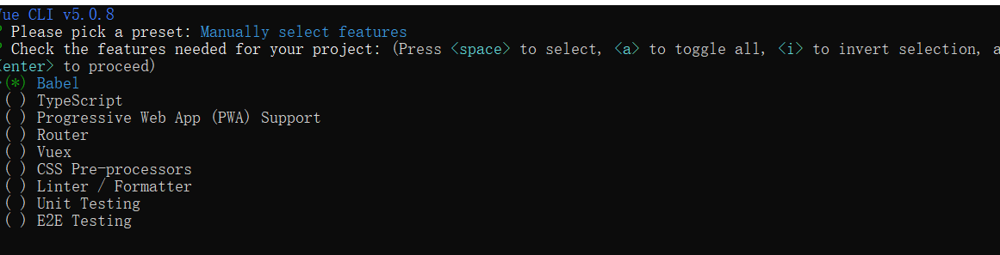

# 一、VUE基本语法

 		Vue (读音 /vjuː/，类似于 **view**) 是一套用于构建用户界面的**渐进式框架**。与其它大型框架不同的是，Vue 被设计为可以自底向上逐层应用。Vue 的核心库只关注视图层，不仅易于上手，还便于与第三方库或既有项目整合。另一方面，当与现代化的工具链以及各种支持类库结合使用时，Vue 也完全能够为复杂的单页应用提供驱动。 

## 1、安装vue 

- ##### 方式一：直接使用script标签引入

    ```html
    <script src="https://unpkg.com/vue@next"></script>
    ```

- ##### 方式二： npm安装

    在用 Vue 构建大型应用时，推荐使用 NPM 安装 

    ```js
    npm install vue
    ```

## 2、vue的指令 和 插值

- {{ value}｝:插值表达式

* v-text:填充纯文本内容
* v-html:填充html
* v-pre:填充原始数据

```python
<div id="app">
    <p>{{age}}</p>
    <div v-text="msg">123</div>
    <div v-html="desc"></div>
    <div v-pre>{{desc}}</div>
</div>
<script type="text/javascript">
    //创建vue应用实例对象 
    const app = Vue.createApp({
        data(){
            return{
                name:"musen",
                age:19,
                desc:'<h1></h1>'
            }
        }
    })
    // 挂载到根节点 
    const vm = app.mount('#app')
</script>
```

## 3、属性绑定

一、属性绑定：v-bind

使用:属性 也可以简写为 :属性

```html
<a v-bind:href="dynamicId"></a>
简写：
<a :href="dynamicId"></a>
```


## 4、事件绑定

- #### v-on:为元素绑定一个事件，绑定点击事件：

    - ###### v-on:click = '指定执行的方法'
    
    - ###### v-on：可以简写为 @：@click 
    
- ##### 事件绑定函数参数的传递：

    - 1、如果事件直接绑定函数的名称，默认会把事件对象作为函数的第一个参数传递

        ```js
        sub:function(event){
            console.log(event.target)
        	this.number--
        	}
        ```

    - 2、如果事件绑定的函数，传参调用，事件对象可以通过$event来传递（最后一个参数）

        ```js
    add:function(p,event){
            console.log(event)
            console.log(p)
            this.number++
            }
        ```


##  5、vue的双向数据绑定

- ##### v-model:页面修改数据会变，数据改变，页面也会改

    ```
            事件监听
    view -----> vm ------>model
            数据绑定
    view <----- vm <------model
    ```

- 案例代码

```html
<div id="app">
    <div v-text="msg">123</div>
   <div>
       <input type="text" v-model="msg">
   </div>
</div>

<script type="text/javascript">
      //创建vue应用实例对象 
    const app = Vue.createApp({
        data(){
            return{
                name:"musen",
                age:19,
                desc:'<h1></h1>',
                mag:""
            }
        }
    })
    // 挂载到根节点
    const vm = app.mount('#app')
</script>
```

## 6、分支语句

```js
[{case_id: 1,title: "用例001",result: "success"},
{case_id: 1,title: "用例002",result: "error"},
{case_id: 1,title: "用例003",result: "fail"}]
```

- ##### 通过条件来控制元素是否渲染到页面

- ###### v-if：判断条件成立时显示

- ###### v-else: 条件不成立时显示

- ###### v-show:控制元素是否显示到页面（本质就是display属性的控制）

## 7、遍历语句

- #####  v-for：遍历数组

​    <li v-for="name in names">{{name}}</li>

- ##### v-for:遍历对象

​    <li v-for="(key,value) in names">{{key}}{{value}}</li>

- ##### v-for集合v-if一起使用：

​    <li  v-for="(info,index) in infos">

```js
[
    {
        case_id: 1,
        title: "用例001",
        result: "success"
    },
    {
        case_id: 2,
        title: "用例002",
        result: "error"
    },
    {
        case_id: 3,
        title: "用例003",
        result: "fail"
    }, 
    {
        case_id: 4,
        title: "用例004",
        result: "success"
    }, {
        case_id: 5,
        title: "用例004",
        result: "success"
    },
]
```


# 二、高级特征

## 1、修饰符

#### 1、事件修饰符：

​    .stop:阻止冒泡（事件冒泡:点击子元素，事件会一级一级冒泡到父元素）

​    .prevent:阻止的默认行为事件行为

```html
<div id="app">
    <div @click="work">
        <button type="button" @click.stop="work2()">按钮1</button>
    </div>
    <a href="https://www.baidu.com" @click.prevent='work3()'>百度</a>
</div>
<script type="text/javascript">
   const app = Vue.createApp({
        methods:{
            work:function(){
                console.log('调用了work方法')
            },
            work2:function(){
                console.log('---work2----')
            },
            work3:function(){
                console.log('---work3----')
            }
        }
    })
   	// 挂载到根节点
	const vm = app.mount('#app')
</script>

```

#### 2、按键修饰符

 在监听键盘事件时，我们经常需要检查详细的按键。Vue 允许为 `v-on` 在监听键盘事件时添加按键修饰符： 

```html
<div id="app">
    <form action="">
        账号：<input type="text" v-model="loginForm.user"> <br>
        密码：<input type="password" v-model="loginForm.pwd" @keyup.enter="login_btn()">
        <button type="button" @click="login_btn()">点击登录</button>
    </form>
</div>
<script type="text/javascript">
    var app = Vue.createApp({
        data(){
            retrun  {
                loginForm:{
                    user:'',
                    pwd:''
                }
        	}
        },
        methods:{
            login_btn(){
                console.log('用户登录的数据为：',this.loginForm)
            }
        }
    })
    // 挂载到根节点
	const vm = app.mount('#app')
</script>
```

#### 3、表单修饰符

- ##### `.lazy`

在默认情况下，`v-model` 在每次 `input` 事件触发后将输入框的值与数据进行同步 (除了[上述](https://cn.vuejs.org/v2/guide/forms.html#vmodel-ime-tip)输入法组合文字时)。你可以添加 `lazy` 修饰符，从而转为在 `change` 事件_之后_进行同步：

```python
<!-- 在“change”时而非“input”时更新 -->
<input v-model.lazy="msg">
```

- ##### `.number`

如果想自动将用户的输入值转为数值类型，可以给 `v-model` 添加 `number` 修饰符：

```python
<input v-model.number="age" type="number">
```

这通常很有用，因为即使在 `type="number"` 时，HTML 输入元素的值也总会返回字符串。如果这个值无法被 `parseFloat()` 解析，则会返回原始的值。

- ##### `.trim`

如果要自动过滤用户输入的首尾空白字符，可以给 `v-model` 添加 `trim` 修饰符：

```python
<input v-model.trim="msg">
```

#### 4、其他修饰符（自行扩展）

- 系统修饰符
- 鼠标按钮修饰符

## 2、计算属性 computed 

在vue中，如果我们需要通过一个或多个数据来计算出来另一个数据，应该怎么去做？

比如：根据用户选择商品的数量来计算商品的总价格。这个时候我们就可以通过计算属性来实现。

 计算属性是`vue`实例中,可以通过`computed`这个配置项来定义计算属性。 

- ##### 例子

```html
<div id="app">
  <p>价格: "{{ price}}"</p>
  <p>数量: "{{ number }}"</p>
  <p>总金额: "{{ sumPrice }}"</p>
</div>

<scirpt>
    var vm = Vue.createApp({
      data: {
        return{
    		number:1
    		price:2
    	}
      },
      computed: {
        sumPrice: function () {
          return this.number * this.price
        }
      }
    }).mount('#app')
</scirpt>
```

## 3、侦听器-watch

 Vue 提供了一种更通用的方式来观察和响应 Vue 实例上的数据变动：侦听器

在vue中可以使用watch来定义侦听器，案例如下：

```js
const app = Vue.createApp({
    data: {
        price: 20,
        number: 0,
    },
    watch:{
        // 侦听number这个属性是否发生变化
        number:function(val){
        console.log(val)
        if (val<0){
           alert('数量不能少于0 ')
           this.number = 0
                }
        }
      }
})
app.mount('#app')
```

- ###### 练习案例：通过侦听器检查注册的用户名是否可用

- ##### 监听多层嵌套的数据

```js
watch:{
    loginForm:{
        handler: function(value, oldVal) {
        console.log(value)
        },
        deep: true
	}
}
```


## 4、vue生命周期钩子

  

# 三、组件化开发

- #### 什么是组件？

## 1、组件注册和使用  

#### 1、注册全局组件

- ##### 方式一：使用全局的Vue直接注册：Vue.component

```js
 // 定义一个组件
app.component('button-test', {
    // 组件中的数据
    data() {
        return {
            count: 0
        }
    },
    // 组件的模板
    template: `
        <div>
        <button @click="handle">点击了{{count}}次</button>
        <HelloWorld></HelloWorld>
        <button>测试</button>
        </div>
        `,
    // 组件中的方法;
    methods: {
        handle: function () {
            this.count ++;
        }
    },
});
```

#### 2、组件的使用

在template中之间使用组件名的闭合标签使用

```xml
 <hello-test2></hello-test2>
```


#### 3、组件使用的注意点

- ##### 1、组件中的data必须是一个函数，子组件中的数据是独立的

- ##### 2、组件的模板必须要包含一个根元素

- ##### 3、组件中的模板内容可以是字符串的形式

- ##### 4、组件的命名和使用注意点

    - ##### 如果组件使用驼峰式命名规则命名（HelloWorld），在字符串模板中，可以使用驼峰式命名规范（HelloWorld）

    - ##### 在普通的标签模板中使用时，要使用（hello-world）


#### 4、局部组件注册

使用vue实例的components配置项进行注册

- ###### 注意点：局部组件只能在注册他的父组件中使用

```js
// 定义组件对象 
var hello_test2 = {
        // 组件中的数据
        data: function () {
            return {
                count: 0
            }
        },
        // 组件的模板
        template: `
        <div>
        <button>hello_test2</button>
        </div>
        `,
        // 组件中的方法;
        methods: {
            handle: function () {
                this.count += 2;
            }
        },
    };

// 实例化vue对象
var app = Vue.createApp({
    // 注册子组件
    components: {
        'hello-test2': hello_test2
    }
});
app.mount('#app')
```


## 2、父组件往子组件中传数据

- #### 实现步骤：

    - ##### 1、子组件内部定义props接收传递过来的值

        ```js
        app.component('HelloWorld', {
                // 接收父组件中的传递值
                props: [
                    'title',
                    'MenuTitle'
                ],
                // 组件中的数据
                data: function () {
                    return {
                        count: 0
                    }
                },
                // 组件的模板
                template: `
                <div>
                <button>父组件传递的数据2:{{title}}</button>
                <button>父组件传递的数据3:{{MenuTitle}}</button>
                </div>
                `
            });
        
        
        ```

    - ##### 2、父组件在使用子组件时通过属性将值传递给子组件

        ```html
        <div id="app">
            <h1>下面是使用子组件,并传递了两个值title和menu-title给子组件</h1>
            <hello-world :title="ptitle" menu-title="12131"></hello-world>
        </div>
        ```

        

- #### props传值的注意点：

    - ###### 子组件中props可以以驼峰形式规则接收参数(使用MenuTitle接收，使用menu-title传递，)

    - ###### 字符串的模板中可以使用驼峰形式，传递参数

    - ###### 非字符串的模板中(父组件)传递值的时候要使用下划线的命名形式(menu-title）


## 3、子组件往父组件中传数据

- #### 实现步骤：

    - ##### 1、子组件中自定义一个事件

        下面通过$emit 触发自定义的事件，并分别传入对应的参数。

        ```js
            app.component('HelloWorld', {
                // 组件中的数据
                data: function () {
                    return {
                    }
                },
                // 组件的模板
                template: `
                <div>
                <button @click="$emit('ele-text',5)">定义ele-text事件</button>
                <button @click="$emit('ele-text2',10)">定义ele-text2事件</button>
                </div>
                `,
            });
        ```

    - ##### 2、在父组件中监听事件

        监听子组件中定义的事件，

        当触发事件时，子组件中传递过来的数据，父组件可以通过$event来接收。

        ```html
        <div id="app">
            <div>原始数据:{{fontSize}}</div>
            <hello-world @ele-text="handle($event)"  ></hello-world>
        </div>
        ```


## 4、插槽

- ##### 插槽的作用：实现父组件往子组件中传递内容

#### 1、组件插槽

- ##### 定义组件时定义插槽

```js
    app.component('test-demo1', {
        // 组件的模板
        template: `
        <div>
            <span>slot预留一个插槽</span>
            <slot></slot>
        </div>
        `,
    });
```

- ##### 使用组件时，可以往插槽中传递内容

```html
<test-demo1>
    <h1>往插槽中插入的内容</h1>
</test-demo1>
```

#### 2、具名插槽

- ##### 定义插槽时，通过name属性给插槽设置一个名字

    ```html
        Vue.component('test-demo1', {
            // 组件的模板
            template: `
            <div>
                <div class='box1'>
                    <slot name="demo1"></slot>
                </div>
                <div class='box2'>
                    <slot name="demo2"></slot>
                </div>
            </div>
            `,
        });
    ```

- ##### 使用组件时，通过slot指定插槽的名字(vue2)

    - ###### 注意点：插入多个标签时，通过template来包裹要插入的内容

    ```html
    <div id="app">
        <test-demo1>
            <template slot="demo1">
                <h1>demo1中插入的h1标签</h1>
                <h2>demo1中插入的h1标签</h2>
            </template >
            <p slot="demo2">给demo2插入的数据</p>
        </test-demo1>
    </div>
    ```
    
- ##### 使用组件时，通过v-slot指定插槽的名字(vue3)

    ```html
    <div id="app">
        <test-demo1>
            <template v-slot:demo1>
                <h1>demo1中插入的h1标签</h1>
                <h2>demo1中插入的h1标签</h2>
            </template >
            <p v-slot:demo2>给demo2插入的数据</p>
        </test-demo1>
    </div>
    ```

    

#### 3、作用域插槽

​	如何在插槽中获取组件中的数据，

> 能够访问子组件中数据的插槽，称为作用域插槽，具体实现如下

- 在定义插槽时，将传递给插槽使用的数据设置为插槽的属性

    ```vue
    const my_header = {
        template: `
            <div>	
                <slot name='box1' :item='items'><slot>
            </div>`,
        data(){
            return{
                items:[11,22,33,44]
            }
        }
    }
    ```

- 使用组件时获取插槽中传递过来的数据

    ```html
    <div id="app">
        <my_header>
            // 使用插槽，通过 v-slot:box1 = 'slotProps'指定插槽名字，并slotProps接收插槽传递过来的值
            <template v-slot:box1 = 'slotProps'>
            	<h1 >python:{{slotProps.item}}</h1>
            </template>
        </my_header>
    </div>
    ```

    

## 5、单文件组件

- 后续讲vue-cli的时候详细讲解

```vue
<template>
  // 模板内容（html）
</template>

<script>
    // js代码
	export default{
		data:
        methods:
        
	}
</script>

<style scoped>
    // css样式
</style>
```


# 四、前后端交互axios

​		Axios 是一个基于 promise(异步实现) 的 HTTP 库，可以用在浏览器和 node.js 中使用，原生的js或者使用jquery来发生请求进行前后端数据交互，代码写起来过于复杂。 官方文档地址：http://www.axios-js.com/zh-cn/docs/

## 1、安装axios

- ##### 方式一：使用 npm安装:

```
npm install axios
```

- ##### 方式二：直接通过script全局引用 

```
<script src="https://unpkg.com/axios/dist/axios.min.js"></script>
```

## 2、axios发送get请求

- ##### 案例一：get请求

    ```js
    // 发送get请求，返回一个Promise对象
    const request = axios.get('http://127.0.0.1:5000/api/pro_list')
    request.then(function (response) {
        //请求成功的处理
        console.log(response);
      }).catch(function (error) {
        // 请求失败的处理
        console.log(error);
      });
    ```
    
- ##### 案例二：get请求参数传递

    使用axios发送get请求传递查询字符串参数，有如下两种方式

    - ###### 方式一：直接写在url地址中

        ```js
        const res =  axios.get('http://127.0.0.1:5000/api/pro_list?name=musen')
        ```

    - ###### 方式二：使用params进行传递

        ```js
        const res =  axios.get('http://127.0.0.1:5000/api/pro_list',
                               {params: {"name":"musen"}}
                              )
        ```

## 3、axios发送post请求

- ##### 1、传递json格式的参数

    ```js
    axios.post('http://127.0.0.1:5000/api/user/login', 
        {pwd: 'lemonban',user: 'python01'}
    )
    ```

- ##### 2、传递表单类型的参数

    ```js
    // 构建一个表单参数对象
    var params = new URLSearchParams();
    params.append('user', 'python01');
    params.append('pwd', 'lemonban');
    axios.post('http://127.0.0.1:5000/api/user/login', params)
    ```

    

## 4、全局的axios配置

- ##### 配置基本的host地址

    ```
    axios.defaults.baseURL ='https://api.example.com'
    ```

- ##### 配置请求头信息

    ```js
    axios.defaults.headers.common['Authorization'] = 'Bearer '+ token
    ```


## 5、axios拦截器

- ##### 1、请求拦截器

    ```js
    // 添加请求拦截器
    axios.interceptors.request.use(function (config) {
        // config为请求对象
        // 在发送请求之前
        return config;
      }, function (error) {
        // 对请求错误做些什么
        return Promise.reject(error);
      });
    ```

    - ###### 应用场景：可以在此处获取本地的token值，添加到请求数据中

- ##### 2、响应拦截器

    ```js
    // 添加响应拦截器
    axios.interceptors.response.use(function (response) {
        // 对响应数据做点什么
        return response;
      }, function (error) {
        // 对响应错误做点什么
        return Promise.reject(error);
      });
    ```

## 6、async await的使用

​	如果你不喜欢通过then和catch这个回调的方式来获取数据，也只可以通过async 和await的方式来处理异步部分。

```js
async function login() {
	// 登录接口
    const userInfo = {
        username: 'musen123',
        password: '1234567'
    }
    const response = await axios.post('http://127.0.0.1:8000/user/login/', userInfo)
    console.log(response)
}
```

- ##### 注意点：await 和只能在通过async定义的函数中使用


# 五、路由vue-route

​	Vue Router 是 [Vue.js](http://cn.vuejs.org/) 官方的路由管理器。它和 Vue.js 的核心深度集成，让构建单页面应用变得易如反掌。

## 1、安装vue-router

- ##### 方式一：使用npm安装

    - ###### 安装命令：

        ```shell
        vue add router
        ```

- ##### 方式二：直接全局的 script标签引入

    ```html
    <script src="https://unpkg.com/vue-router/dist/vue-router.js"></script>
    ```

## 2、vue-router的基本使用

```js
# 1、定义路由对应的组件
const Login = {template: `<h1>登录页面</h1>`}
const Home =  {template: `<h1>项目首页</h1>`}

# 2、创建一个路由对象,设置路由匹配规则
const router = createRouter({
	  history: createWebHashHistory(),
      routes:[
      { path: '/login', component: Login  },
      { path: '/home', component: Home }
    ]
})
# 3、将路由对象挂载到vue实例中
const app = Vue.createApp({})
app.use(router)
app.mount('#app')
# 4、#app中使用<router-view><\router-view>来定义路由展示位
```


## 3、编程式和声明式导航(页面跳转)

- 导航----->(页面跳转)

#### 1、声明式

```vue
<router-link to="/login">登录</router-link>
```

```vue
// to后面是一个对象时，要使用属性绑定
<router-link :to="{ path: '/login'}">登录</router-link>
```

#### 2、编程式

在项目中我们有些时候需要主动去访问某个路由，比如登录成功之后，需要跳转到项目首页，那么 在 Vue 实例内部，你可以调用 `this.$router.push`，主动访问某个路由。

```js
this.$router.push('/login')
```

```js
this.$router.push({path: '/login'})
```

## 4、路由重定向

- ##### 通过redirect可以指定重定向的路由地址

```js
const router = createRouter({
	history: createWebHashHistory(),
  	routes: [
    	{ path: '/index', redirect: '/login' }
 	]
})
```


## 5、命名路由

你可以在创建 Router 实例的时候，在 `routes` 配置中给某个路由设置名称。 

```js
const router = createRouter({
  history: createWebHashHistory(),
  routes: [
    {
      path: '/user/login',
      name: 'user',
      component: User
    }
  ]
})
```

路由命名后可以直接通过name指定路由名访问

- ###### 声明式

```js
<router-link :to="{ name: 'login'}">登录</router-link>
```

- ###### 编程式

```js
this.$router.push({name: 'login'})
```


## 6、路由嵌套

一个路由中嵌套多个子路由（一个页面中根据不同的情况显示不同的内容）

```javascript
const Home = {
    template: `
    <div class="main">
        <div class="topMenu" style="height: 100px;background: #000000;">
            <router-link :to="{name:'pro'}">
            	<button type="button">个人中心</button>
            </router-link>
            <router-link :to="{name:'inter'}">
            	<button type="button">订单管理</button>
            </router-link>
            <router-link :to="{name:'env'}">
            	<button type="button">用户管理</button>
            </router-link>
        </div>
        <div class="content">
        	<router-view></router-view>
        </div>
    </div>
`
}
const Project = {
    template: `
    <div>
    	<h1>个人中心</h1>
    </div>
	`
	}
const InterFace = {
    template: `
    <div>
    	<h1>订单管理</h1>
    </div>
    `
    }
const Env = {
    template: `
    <div>
    	<h1>用户管理</h1>
    </div>
    `
    }
```


```js
const routes = [{
        path: '/',
        component: Home,
        name: 'home',
        children: [
            {path: '/project',component: Project,name: 'pro'},
            {path: '/interface',component: InterFace,name: 'inter'},
            {path: '/env',component: Env,name: 'env'}
        ]
    }]
```

> 访问嵌套路由的路径时，对应的组件会渲染在父路由预留的路由展示位中


## 7、路由动态匹配及参数

#### 1、路径参数

在项目中我们可能会需要把 `/user/111` 和 `/user/112` 都将映射到同一个路由,那么此时我们只需要在配置路由的时候把user后面的数据参数化处理即可

- ###### 动态路径匹配

```js
const router = createRouter({
  history: createWebHashHistory(),
  routes: [
    // 动态路径参数 以冒号开头
    { path: '/user/:id', component: User },
    { path: '/user/:id/:key', component: User }   
  ]
})
```

- ###### 参数传递

    ```js
    this.$router.push({
        name: 'user',
        params: {
            id: 111,
            key:'login'
        }
    })
     //params传递的参数可以在路由对应的组件中通过 $route.params.参数 使用
    ```

#### 2、查询参数query

查询参数类似于get请求的参数形式，`/user/login/?user=123&pwd=23333`

```js
this.$router.push({
    name: 'user',
	query:{
        user:123,
        pwd:23333
        }
})
//匹配到的参数可以在路由对应的组件中通过 $route.query.参数 使用
```


## 8、路由导航守卫

- ##### 路由全局前置拦截器： router.beforeEach 


```js
router.beforeEach((to, from, next) => {
    // to:表示将要访问的路径
    // from 代表从哪个路径而来
    // next 是一个函数，表示执行下一步
    //判断是否访问的是登录页面
    if (to.path === '/login') return next()
    // 判断当前是否能获取到token
    if (window.sessionStorage.getItem('token')) return next()
    // 没有token，则跳转到登录页面
    return next('/login')	
})
```


#### 扩展

- ######  匹配优先级

    如果同一个路径可以匹配多个路由，此时，匹配的优先级就按照路由的定义顺序：谁先定义的，谁的优先级就最高。

- ###### 匹配所有路由或 404 Not found 路由

    * 表示通配符，匹配所有的内容

    ```js
    
      
    const router = createRouter({
    	history: createWebHashHistory(),
    	routes: [
        // 动态路径参数 以冒号开头
        { path: '/*', component: Page404 }
      ]
    })
    ```
    
    


# 六、VUE-CLI

Vue CLI 是一个基于 Vue.js 进行快速开发的完整系统，提供：

- 通过 `@vue/cli` 实现的交互式的项目脚手架。
- 一个丰富的官方插件集合，集成了前端生态中最好的工具。
- 一套完全图形化的创建和管理 Vue.js 项目的用户界面。

> #### 环境安装
>
> ###### 1、安装好nodejs
>
> - 官网下载安装包，点击安装即可
>
> ##### 2、安装cnpm 
>
> - npm的国内镜像源(安装依赖时更快)
>
> ```python
> npm install -g cnpm -registry=https://registry.npm.taobao.org
> ```

## 1、安装vue-cli

- ##### 安装vue-cli

    ```python
    npm install -g @vue/cli
    ```


## 2、使用vue-cli创建项目

- ###### 通过命令创建

  > 1、输入创建项目的命令
  >
  > ```
  > vue create 项目名
  > ```
  >
  > 2、选择自定义配置
  >
  >  
  >
  > 3、选择安装的插件
  >
  > 
  >
  > 4、选择vue版本
  >
  > 
  >
  > 5、选择配置文件存放方式
  >
  > 
  >
  > 6、是否保存创建项目的配置
  >
  > 
  >
  > 回车确认

## 3、插件安装和依赖

- ###### vue ui中创建项目直接


# 七、VUEX

## 1、VUEX介绍

官网地址：https://vuex.vuejs.org/zh/guide/


### 1、什么是VUEX？

>  Vuex 是一个专为 Vue.js 应用程序开发的**状态(state)管理模式的库**。它采用集中式存储管理应用的所有组件的状态，并以相应的规则保证状态以一种可预测的方式发生变化。 
>
>  每一个 Vuex 应用的核心就是 store（仓库）。store就是一个容器，它包含着你的应用中大部分的**状态 (state)**。Vuex 和单纯的全局对象有以下两点不同：
>
>  1. Vuex 的状态存储是响应式的。当 Vue 组件从 store 中读取状态的时候，若 store 中的状态发生变化，那么相应的组件也会相应地得到高效更新。
>  2. 你不能直接改变 store 中的状态。改变 store 中的状态的唯一途径就是显式地**提交 (commit) mutation**。这样使得我们可以方便地跟踪每一个状态的变化，从而让我们能够实现一些工具帮助我们更好地了解我们的应用

### 2、vue的核心组成

> - #### State:  全局状态(数据)
>
> - #### Getter:  全局计算属性
>
> - #### Mutation:  修改全局状态(数据)
>
> - #### Action：定义异步方法，提交Mutation

### 3、vuex 和localstorage、sessionstorage的区别？

> ##### 1、存储：
>
> - vuex存储在内存中,当刷新页面（这里的刷新页面指的是 --> F5刷新,属于清除内存）,vuex存储的值会清除
> - sessionstorage( 会话存储 ) ,临时保存，页面关闭后就清除掉。
> - localstorage（本地存储）则以文件的方式存储在本地,永久保存
> - localStorage和sessionStorage只能存储字符串类型，vuex中可以直接存储js对象
>
> ##### 2、应用场景：
>
> - ###### vuex(响应式的)用于组件之间的传值，
>
> - ###### localstorage，sessionstorage则主要用于不同页面之间的传值。（非响应式的，页面刷新重新读取数据才会更新）


### 4、环境安装

> ##### 1、npm安装
>
> ```
> npm install vuex@next --save
> ```
>
> ##### 2、vue-cli创建的项目
>
> 针对于vue-cli创建的项目，可以在创建项目的时候选中安装vuex的插件，也可以自己通过命令添加插件
>
> ```python
> vue add vuex
> ```


## 2、Vuex的使用

每一个 Vuex 应用的核心就是 store（仓库）。store就是一个容器，它包含着你的应用中大部分的**状态 (state)**。Vuex 和单纯的全局对象有以下两点不同：

1. Vuex 的状态存储是响应式的。当 Vue 组件从 store 中读取状态的时候，若 store 中的状态发生变化，那么相应的组件也会相应地得到高效更新。
2. 你不能直接改变 store 中的状态。改变 store 中的状态的唯一途径就是显式地**提交 (commit) mutation**。这样使得我们可以方便地跟踪每一个状态的变化，从而让我们能够实现一些工具帮助我们更好地了解我们的应用。

### 1、State

> ##### 1、作用：用来定义公共的数据
>
> ###### 2、定义：
>
> ```js
> const store = createStore({
>     state () {
>         return {
>             count: 0,
>             title:'全局数据title'
>         	}
>         },
> })
> ```
>
> ###### 3、组件中使用：
>
> ```js
> //使用全局数据 count
> this.$store.state.count
> //使用全局数据 title
> this.$store.state.title
> ```
>
> ###### 4、辅助函数：mapState
>
> 通过辅助函数mapState，可以将state 的数据映射为组件中的计算属性 
>
> ```js
> import { mapState } from 'vuex'
> 
> export default {
> computed:{
> // 方式一：映射为同名的计算属性 
> // 映射 this.count 为 store.state.count
> 	... mapState(['count']),
> // 方式二：映射为指定名称的计算 
> // 映射 this.countX 为 store.state.count
> 	... mapState({countX:"count"})
> }
> }
> ```

### 2、Getter

> ##### 1、作用：store 的计算属性 
>
> ###### 2、定义：
>
> ```js
> const store = createStore({
> state: {
> users: [
> { id: 1, age: 17,name:"张三" },
> { id: 2, age: 23,name:"李四"},
> { id: 3, age: 14,name:"王五"},
> { id: 4, age: 34,name:"大刘" }
> ]
> },
> getters: {
> // 获取users中年龄少于18的用户
> user1 (state) {
> return state.todos.filter(item => item.age<18)
> }
> }
> })
> ```
>
> ###### 3、组件中使用：
>
> ```js
> this.$store.getters.user1
> ```
>
> ###### 4、辅助函数：`mapGetters` 
>
> 辅助函数`mapGetters` 可以将 store 中的 getter 映射到组件的计算属性：
>
> ```js
> import { mapGetters } from 'vuex'
> 
> export default {
>     computed: {
>     	...mapGetters(['user1'])
>     }
> }
> ```

### 3、Mutation

> ##### 1、作用：用来定义公共的修改数据同步方法
>
> ###### 2、定义Mutation：
>
> ```js
> const store = createStore({
> state: {
> count: 1
> },
> mutations: {
> addCount (state) {
> // 变更状态
> state.count++
> }
> }
> })
> ```
>
> ###### 3、组件中使用：
>
> ```js
> this.$store.commit('increment')
> ```
>
> ###### 4、辅助函数：mapMutations
>
> 在组件中可以使用辅助函数 `mapMutations` 将mutations映射为组件中的方法
>
> ```js
> import { mapMutations } from 'vuex'
> 
> export default {
> methods: {
> 	// 方式一：映射为同名方法
> // 将 `this.addCount()` 映射为 `this.$store.commit('addCount')`
> ...mapMutations(['addCount']),
> // 方式二：映射为指定的方法名
> // 将 `this.add()` 映射为 `this.$store.commit('addCount')`
> ...mapMutations({add: 'addCount'})
> }
> }
> ```

### 4、Action

> ##### 1、作用：用来定义公共的异步方法(比如涉及到接口请求的方法)
>
> ###### 2、定义：
>
> ```js
> const store = createStore({
>     state: {
>         count: 0
>         },
>     mutations: {
>         add (state) {
>             state.count++
>         }
>     },
>     actions: {
>         async getData (context) {
>             // 进行异步操作，如发送请求  
>             context.commit('add')
>         }
>     }
> })
> ```
>
> ###### 3、使用：
>
> 在组件中，直接使用actions中的方法
>
> ```js
> this.$store.dispatch('increment')
> ```
>
> ###### 4、辅助函数：mapActions
>
> 在组件中使用Actions时，可以通过mapActions将vuex中的Actions映射为当前组件的方法
>
> ```js
> import { mapActions } from 'vuex'
> 
> export default {
> // ...
> methods: {
> 	// 方式一：映射为同名方法
> // 将 `this.getData()` 映射为 `this.$store.dispatch('getData')`
> ...mapActions(['getData']),
> // 方式二：指定映射的方法名
> // 将 `this.add()` 映射为 `this.$store.dispatch('getData')`
> ...mapActions({add: 'getData' })
> }
> }
> ```

### 5、Module

> ##### 1、作用：开发大型应用时，全局数据多的情况下，可以使用Module将stroe拆分为若干个模块,方便管理
>
> ###### 2、定义：
>
> ```js
> //定义模块A
> const moduleA = {
> state: () => ({ ... }),
> mutations: { ... },
> actions: { ... },
> getters: { ... }
> }
> const moduleB = {
> state: () => ({ ... }),
> mutations: { ... },
> actions: { ... },
> getters: { ... }
> }
> //定义模块B
> const store = createStore({
> // 创建stroe时，将添加模块  
> modules: {
> a: moduleA,
> b: moduleB
> }
> })
> ```
>
> ###### 3、使用：
>
> 组件中使用某个模块中的数据时,可以通过this.$store.state.模块名
>
> ```js
> this.$store.state.a // -> moduleA 的状态
> this.$store.state.a // -> moduleB 的状态
> 
> ```


